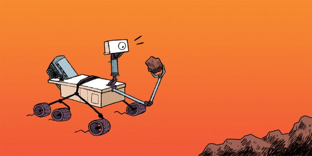
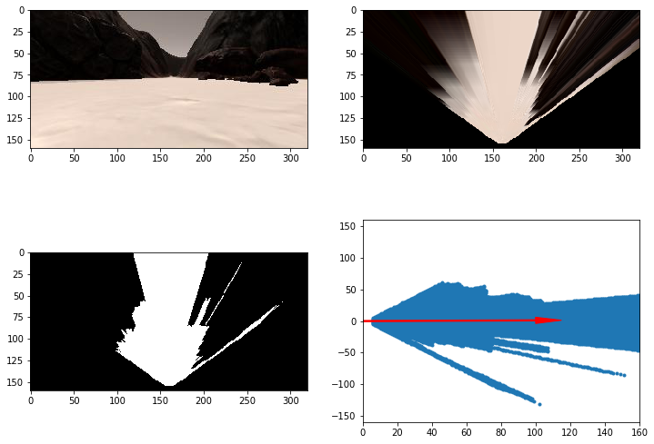
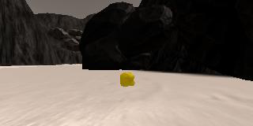
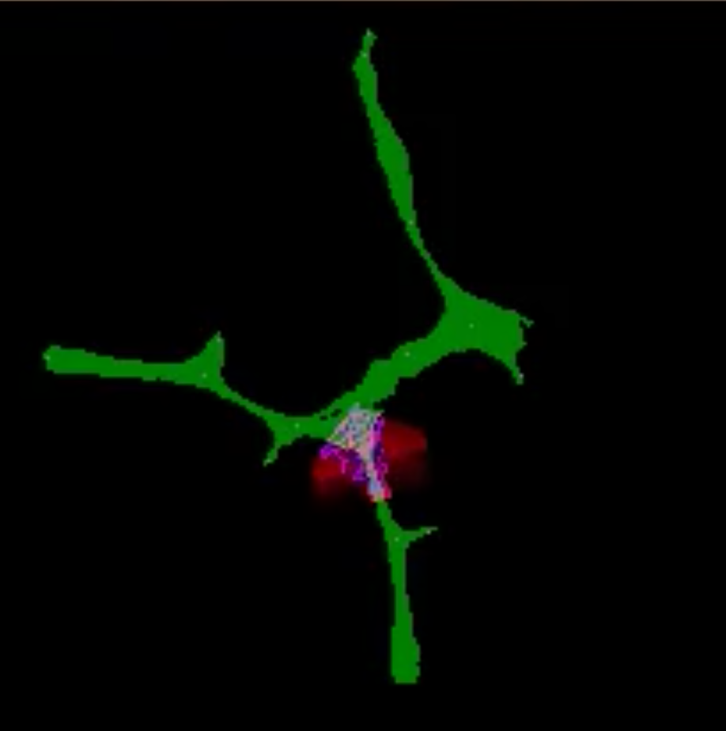

# Sample And Return



## Jupyter Training / Calibration



The first part of the pipeline is concerned with performing a perspective transform on the source image to get a top down view of the image from the camera. A popular adjustment was to return a field of view mask from here but I opted to have a separate function for it.

```python
def field_of_view(img, src, dst):
    """
    Provides a mask to index our array such that we don't map values out of
    view of the cameras field of view
    """
    M = cv2.getPerspectiveTransform(src, dst)
    fov = cv2.warpPerspective(np.ones_like(img[:, :, 0]), M, (img.shape[1],
                              img.shape[0]))
    return fov

def perspect_transform(img, src, dst):
    """
    Applies a perspective transform of the image given the source and
    destination pixel positions.
    """
    M = cv2.getPerspectiveTransform(src, dst)
    warped = cv2.warpPerspective(img, M, (img.shape[1],
                                 img.shape[0]))  # keep same size as input image
    return warped

dst_size = 5
bottom_offset = 6
source = np.float32([[14, 140], [301 ,140],[200, 96], [118, 96]])
destination = np.float32([[image.shape[1]/2 - dst_size, image.shape[0] - bottom_offset],
                  [image.shape[1]/2 + dst_size, image.shape[0] - bottom_offset],
                  [image.shape[1]/2 + dst_size, image.shape[0] - 2*dst_size - bottom_offset], 
                  [image.shape[1]/2 - dst_size, image.shape[0] - 2*dst_size - bottom_offset],
                  ])
```

Next we apply our color thresholding function on the image. This converts the color image into a single channel image with each pixel being indicated as being traversable or not.

```python
def color_thresh(img, rgb_thresh=(160, 160, 160)):
    """
    Returns an array of 1s and 0s where a 1 indicates the source pixel was
    above the given threshold and 0 indicates it was not. The returned array
    will be of the same shape as the source array, but is a single channel.
    """
    # Create an array of zeros same xy size as img, but single channel
    color_select = np.zeros_like(img[:, :, 0])

    # Require that each pixel be above all three threshold values in RGB
    # above_thresh will now contain a boolean array with "True"
    # where threshold was met
    above_thresh = (img[:, :, 0] > rgb_thresh[0]) \
        & (img[:, :, 1] > rgb_thresh[1]) \
        & (img[:, :, 2] > rgb_thresh[2])

    # Index the array of zeros with the boolean array and set to 1
    color_select[above_thresh] = 1
    # Return the binary image
    return color_select
```

Finally we adjust the coordinates such that the camera on the rover is the origin.

```python
def rover_coords(binary_img):
    """
    Returns coordinates with the rover camera as the origin (0, 0)
    """
    # Identify nonzero pixels
    ypos, xpos = binary_img.nonzero()
    # Calculate pixel positions with reference to the rover position being at
    # the center bottom of the image.
    x_pixel = -(ypos - binary_img.shape[0]).astype(np.float)
    y_pixel = -(xpos - binary_img.shape[1] / 2).astype(np.float)
    return x_pixel, y_pixel
```

In this final image we have also calculated the average angle. This will provide the rover with a reasonably good direction to go in. I didn't change this to implement wall crawling like was suggested in the notes as I was hoping to get a path finding algorithm implemented to handle guiding the rovers general direction and only use the camera vision for sample detection and obstacle avoidance.

```python
arrow_length = 100
x_arrow = arrow_length * np.cos(mean_dir)
y_arrow = arrow_length * np.sin(mean_dir)
plt.arrow(0, 0, x_arrow, y_arrow, color='red', zorder=2, head_width=10, width=2)
```

Next we need to write a function to detect the samples we want to collect. We can use a variation of the `color_thresh` function we defined for thresholding the camera images along with a suitable selector obtained by inspecting the calibration images.



```python
def find_rocks(img, selector=(110, 110, 50)):
    """
    Returns an array of 1s and 0s where a 1 indicates a pixel matched the given
    selector, and a 0 indicates it has not.
    This is a variation of _color_thresh specifically for finding rocks (the
    selector is a little different).
    """
    gold_pix = ((img[:, :, 0] > selector[0]) &
                (img[:, :, 1] > selector[1]) &
                (img[:, :, 2] < selector[2]))

    rock_map = np.zeros_like(img[:, :, 0])
    rock_map[gold_pix] = 1
    return rock_map
```

The `process_image` step is where it all gets brought together to process a given frame and map what we see.
1. Define our source and destination coordinates for our perspective transform and apply it. Call `field_of_view` with the same values to get our mask. This is important as we don't want to mark anything on our map for the parts of the image that are outside the cameras field of view.
1. Next we apply the `color_thresh` function to give us our array of navigable pixels.
1. We can obtain our obstacles by inverting terrain array and applying the fov mask.
1. We can then convert both navigable terrain pixels and obstacle pixels to the rovers coordinate space.
1. Next we call `should_map` and add the pixels to their respective channels in the worldmap. `should_map` will always return true as the `DataBucket` doesn't contain `roll` and `pitch` to inspect.
1. We try find any rock pixels in the image and if so, find the closest one. We then convert this pixel to coordinates with reference to the rovers position and plot it on the worldmap.
1. We then build out the mosaic by filling the `output_image` pixels to be a combination of images from our pipeline.

```python
def process_image(img):
    output_image = np.zeros((img.shape[0] + data.worldmap.shape[0], img.shape[1] * 2, 3))
    output_image[0:img.shape[0], 0:img.shape[1]] = img  # show original in top left

    source = np.float32([[14, 140], [301, 140], [200, 96], [118, 96]])

    destination = np.float32([[img.shape[1] / 2 - (SCALE / 2), img.shape[0] - BOTTOM_OFFSET],
                              [img.shape[1] / 2 + (SCALE / 2), img.shape[0] - BOTTOM_OFFSET],
                              [img.shape[1] / 2 + (SCALE / 2), img.shape[0] - 2 * (SCALE / 2) - BOTTOM_OFFSET],
                              [img.shape[1] / 2 - (SCALE / 2), img.shape[0] - 2 * (SCALE / 2) - BOTTOM_OFFSET],
                              ])

    fov = field_of_view(img, source, destination)
    warped = perspect_transform(img, source, destination)

    navigable_threshold = (160, 160, 160)
    navigable_terrain = color_thresh(warped, navigable_threshold)

    obstacles = np.absolute(np.float32(navigable_terrain) - 1) * fov

    worldmap_size = data.worldmap.shape[0]

    rover_x, rover_y = rover_coords(navigable_terrain)
    rover_x_world, rover_y_world = pix_to_world(rover_x, rover_y,
                                                 data.xpos[data.count], data.ypos[data.count], data.yaw[data.count], worldmap_size, SCALE)

    obstacles_x, obstacles_y = rover_coords(obstacles)
    obstacles_x_world, obstacles_y_world = pix_to_world(obstacles_x, obstacles_y,
                                                         data.xpos[data.count], data.ypos[data.count], data.yaw[data.count], worldmap_size, SCALE)

    # we are only mapping in one plane. we need to make sure we don't map anything when the robot is all topsy-turvy
    #if should_map(data.roll[count], data.pitch[count]):
    if should_map(0, 0):
        # we are sure about navigable terrain
        data.worldmap[rover_y_world, rover_x_world, NAVIGABLE_CHANNEL] += 10  # we are sure about navigable terrain
        data.worldmap[rover_y_world, rover_x_world, OBSTACLE_CHANNEL] -= 10  # we are sure about navigable terrain

        # slowly build up confidence that a pixel is in fact an obstacle. If it
        # isn't then we will set it to 0 when we see it as navigable anyway
        data.worldmap[obstacles_y_world, obstacles_x_world, OBSTACLE_CHANNEL] += 1

    rock_map = find_rocks(warped)
    if rock_map.any():
        rock_x, rock_y = rover_coords(rock_map)
        rock_x_world, rock_y_world = pix_to_world(rock_x, rock_y, data.xpos[data.count], data.ypos[data.count], data.yaw[data.count], worldmap_size, SCALE)

        rock_dist, rock_angles = to_polar_coords(rock_x, rock_y)
        rock_anchor_index = np.argmin(rock_dist)
        rock_anchor_x = rock_x_world[rock_anchor_index]
        rock_anchor_y = rock_y_world[rock_anchor_index]

        data.worldmap[rock_anchor_y, rock_anchor_x, ROCK_CHANNEL] = 255

        # if we found a rock lets go towards it
        data.see_sample = 1
        data.nav_dists = rock_dist
        data.nav_angles = rock_angles

    else:
        # no rock so we abide by our general navigation principles
        data.see_sample = 0
        dist, angles = to_polar_coords(rover_x, rover_y)
        data.nav_dists = dist
        data.nav_angles = angles

    # Let's create more images to add to the mosaic, first a warped image
    warped = perspect_transform(img, source, destination)
    
    # Add the warped image in the upper right hand corner
    output_image[0:img.shape[0], img.shape[1]:] = warped

    # Overlay worldmap with ground truth map
    map_add = cv2.addWeighted(data.worldmap, 1, data.ground_truth, 0.5, 0)
    
    # Flip map overlay so y-axis points upward and add to output_image 
    output_image[img.shape[0]:, 0:data.worldmap.shape[1]] = np.flipud(map_add)

    # Then putting some text over the image
    cv2.putText(output_image, "Populate this image with your analyses to make a video!", (20, 20), 
                cv2.FONT_HERSHEY_COMPLEX, 0.4, (255, 255, 255), 1)
    
    if data.count < len(data.images) - 1:
        data.count += 1 # Keep track of the index in the Databucket()
    
    return output_image
```

I also spent some time working on getting a path finding algorithm implemented. I did this by driving the rover to various points of interest and noting down the position to build out a graph of nodes. All the nodes were added to the `waypoints` list in the `Graph` object I added to the `RoverState`. Nodes I actually wanted to visit were also added to the `goals` list.

Unfortunately I had issues with getting the algorithm to work, however I did render them on my output video (they're hard to see as I only marked the pixel).

```python
class Node():
    def __init__(self, x, y):
        self.x = x
        self.y = y
        self.neighbors = []


class Graph():
    def __init__(self):
        self.waypoints = []
        self.goals = []

        Node1 = Node(99.7, 13.5)
        self.waypoints.append(Node1)
        self.goals.append(Node1)

        Node2 = Node(94.3, 57.2)
        Node1.neighbors.append(Node2)
        Node2.neighbors.append(Node1)
        self.waypoints.append(Node2)

        Node1 = Node(104.8, 61.4)
        Node1.neighbors.append(Node2)
        Node2.neighbors.append(Node1)
        self.waypoints.append(Node1)
        self.goals.append(Node1)

        Node2 = Node(80.7, 83.1)
        Node2.neighbors.append(Node1)
        Node1.neighbors.append(Node2)
        self.waypoints.append(Node2)

        Node1 = Node(70.6, 75.1)
        Node2.neighbors.append(Node1)
        Node1.neighbors.append(Node2)
        self.waypoints.append(Node1)
        self.goals.append(Node1)

        Node3 = Node(77.3, 101.7)
        Node3.neighbors.append(Node1)
        Node1.neighbors.append(Node3)
        self.waypoints.append(Node3)

        Node1 = Node(48.1, 111.1)
        Node2.neighbors.append(Node1)
        Node1.neighbors.append(Node2)
        self.waypoints.append(Node1)

        Node2 = Node(50.8, 120.2)
        Node1.neighbors.append(Node2)
        Node2.neighbors.append(Node1)
        self.waypoints.append(Node2)
        self.goals.append(Node2)

        Node2 = Node(100, 114.8)
        Node1.neighbors.append(Node2)
        Node2.neighbors.append(Node1)
        self.waypoints.append(Node2)
        self.goals.append(Node2)

        Node2 = Node(86, 100)
        Node2.neighbors.append(Node3)
        Node3.neighbors.append(Node2)
        self.waypoints.append(Node2)

        Node1 = Node(108.3, 132.9)
        Node1.neighbors.append(Node2)
        Node2.neighbors.append(Node1)
        self.waypoints.append(Node1)

        Node2 = Node(94.4, 146.1)
        Node2.neighbors.append(Node1)
        Node1.neighbors.append(Node2)
        self.waypoints.append(Node2)
        self.goals.append(Node2)

        Node2 = Node(137.7, 115.1)
        Node2.neighbors.append(Node1)
        Node1.neighbors.append(Node2)
        self.waypoints.append(Node2)

        Node1 = Node(184.1, 102.3)
        Node1.neighbors.append(Node2)
        Node2.neighbors.append(Node1)
        self.waypoints.append(Node1)

        Node2 = Node(190.0, 103.9)
        Node1.neighbors.append(Node2)
        Node2.neighbors.append(Node1)
        self.waypoints.append(Node2)
        self.goals.append(Node2)

Graph = Graph()

for node in Graph.waypoints:
    data.ground_truth[int(node.x), int(node.y), :] = 255
```



## Autonomous Navigation / Mapping

Resolution: 1024 * 768

Quality: Fantastic

FPS: 21

### Perception Step

1. Create `source` and `destination` targets for our perspective transforms.
1. Call `_field_of_view` with `Rover.img`, `source`, and `destination` and save the result as `fov`. We will use this to discard pixels out of view of the camera.
1. Call `_perspect_transform` with `Rover.img`, `source`, and `destination` and save the result as `warped`. This gives us our top down view as:
4. Apply color thresholding on the warped image by calling `_color_thresh` with `navigable_threshold` set to `(160, 160, 160)`. The result contains 1s where navigable terrain is present so we can update our Rovers vision with `Rover.vision_image[: : ,NAVIGABLE_CHANNEL] = navigable_terrain * 255`.
1. We do a similar thing for obstacles by taking `navigable_terrain` and inverting it. We then multiply this by `fov` described above to remove pixels that are actually just out of view and set the pixels red by `Rover.vision_image[:, :, OBSTACLE_CHANNEL] = obstacles * 255`.
1. Next we get the x and y cartesian points for navigable pixels in the Rovers coordinate space by passing `navigable_terrain` to `_rover_coords`.
1. We then convert these to the world coordinate space by calling `_pix_to_world`.
1. Repeat the process for obstacles.
1. Check if the Rover is near enough in the same plane as the world map by calling `_should_map` with the current `Rover.roll` and `Rover.pitch`.
1. Increment `Rover.worldmap` by 10 in the `NAVIGABLE_CHANNEL` for each `rover_y_world, rover_x_world` pair. Decrement these same pixels by 10 in the `OBSTACLE_CHANNEL` as it is possible we may have casted an object across them from a previous frame of reference. **Note the order of the values in the tuple is (y, x).**
    1. Increment `Rover.worldmap` by 1 in the `OBSTACLE_CHANNEL` for each `obstacles_y_world, obstacles_x_world` pair. We want to gradually build up our obstacles and bias in favor of `NAVIGABLE_TERRAIN` as navigable terrain cannot be casted across an obstacle.
1. Check if we can see any rocks by calling `_find_rocks` passing our `warped` as the argument. It returns an array of 1s and 0s indicating if a pixel is a golden rock pixel or not.
    1. If we can see any rocks then get cartesian coordinates for the pixels by calling `_rover_coords` passing `rock_map` in.
    1. We map them in a similar way as the navigable terrain and obstacles.
    1. Finally we set `Rover.see_sample` to 1 and update `Rover.nav_dists` and `Rover.nav_angles` to their respective values. These will be used later in `decision.py` when deciding which way to drive.
    1. If we couldn't see a rock then we set `Rover.see_sample` to 0. We also remove any rock pixels from `Rover.vision_image` otherwise they would hang around indefinitely.
1. Lastly, we return the `Rover` containing the updated state based on what we have seen.

### Decision Step

1. Check if `Rover.nav_angles` has been set. There is nothing to do unless we are perceiving the environment.
1. First check if we are done by calling `_are_we_done` with the Rover. This function will return true if we have all six of the rocks and are near enough in the position we started in. If this function returns true then we set the Rover.mode to 'done' and apply the brake, and set the throttle to 0.
1. If we are not done then we check the Rover.mode to work out what kind of action we want to perform, based on the current Rover state.
    1. Forward
        1. If we can see a sample then we set our Rover.max\_vel to 1, otherwise 2. This is just to prevent the rover from driving up to the rock too quickly and missing it.
        1. If we see a rock and we are not yet close enough to pick it up OR we have enough navigable terrain in front of us we continue to drive forward throttling and coasting at as required by our Rover.max\_vel. We get our steer angle from `_get_steer_angle`. I busted that out into a method because I originally intended to be a bit smarter with my implementation. Currently it returns the average angle, clipped by 15 degrees either side of the origin.
        1. If we can't see enough angles to drive forward or if we are near a rock, we stop.
        1. Finally, we check if we are stuck. I've added some state to the rover to track recent positions to perform some rudimentary calculation of theoretical distance travelled vs actual. If we are stuck then we set `Rover.mode` to stuck.
    1. Stop
        1. Check if we are still moving slightly and apply the brake if so. Otherwise:
            1. If the rover can't see a sample and we don't have enough terrain in fornt of us to drive then we spin counter clockwise.
            1. If the Rover can't see a sample and we have enough terrain in front of us then we can continue to drive forward again.
    1. Stuck
        1. We check if we have exceeded our allocated spin ticks (frames spent spinning) and if not; ensure we are not throttling, set our steer to -15 and increment our tick counter.
        1. Otherwise we reset our ticks to 0 and try to go forward again.
1. Otherwise just drive forward
1. We have a final check if we are stopped near a sample and send through a pickup signal to retrieve it.


### Improvements

* Implement path finding algorithm to build out a path of pixels to take us back to `start_position` when we have completed grabbing all the rocks.
* Implement some concept of an objective or goal such that as the robot gathers more information like locations of rocks that it hasn't yet picked up, it will attempt to navigate in that general direction while still observing the other micro rules based on perception. This could also be used to return to the start once we have found all the rocks and for heading towards unmapped pixels when faced with a fork in the road.
* Make top speed a product of the distance returned by `_to_polar_coordinates`.
* Implement smarter turning when we are stuck or have insufficient navigable terrain in front of us. This isn't ideal as my rover will end up turning around when picking up a rock to its' right.
* It is possible for the rover to get stuck going in a circle if it is in a sufficiently large area of navigable terrain where the majority of that terrain continuously appears in its peripheral vision. It would be good to extend `are_we_stuck` to detect these cases.
